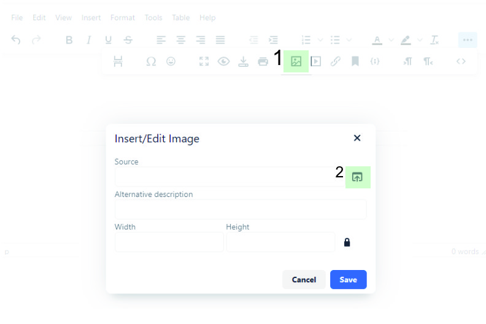

# Installation

## Installation with composer

```
composer create-project toolx/toolx-php-framework
```

# Starting server

With your terminal open application root directory and fire: 

```
php cli serve
```

Note that you must provide URLROOT from **app/Config/urls.php**

Starting server in that manner is for development purposes only!

# Router

## Creating routes

Go to the app/Routes directory. Create route file and add two lines to it...

```
<?php

use App\Engine\Libraries\Router;
$router = Router::getInstance();
```

## Router HTTP verbs

```
$router->get('/', function($req, $res) {});
$router->post('/', function($req, $res) {});
$router->put('/', function($req, $res) {});
$router->patch('/', function($req, $res) {});
$router->delete('/', function($req, $res) {});
$router->all('/', function($req, $res) {});
$router->match('get|post', '/', function($req, $res) {});
```

It is also possible to add routes in the different way.

```
$router->post([
    'route' => 'some/url',
    'controller' => 'PagesController',
    'method' => 'create',
    'csrf' => false
]);

```

Router verb method takes two arguments -  ```$request``` and ```$response```.

```
$router->get('/', function($req, $res) {

    return $res->render('welcome');
});
```

## Bind controller to route

```
$router->get('/', 'HomeController@index');
```

## Bind multiple URLs to the same controller method or closure.

```
$router->get('snow-fall, like-snow, snowfall, snow, fall', 'HomeController@index');
```

## Adding middlewares

```
$router->get('/', 'HomeController@index', ['Middlewares/auth']);
```

It is possible to add multiple middlewares.

## Load routes from directories

Sometimes, if you need to have too many routes, it is more comfortable to has them in additional directories. In order to load those additional directories you need to go to ```app/Config/routes.php``` file and load separate directories from there.

## Get url segments as callback arguments

```
$router->get('books/orange-fox/part-one', function($req, $res, $x, $y, $z) {

    dd( $y ); // orange-fox
});
```

## Create routes with CLI

```
php cli make:routes optional/path/routerName
```

## Router placeholder

| Placeholders | Description                                                                               |
| ------------ | ----------------------------------------------------------------------------------------- |
| (:continue)  | Continues url segments                                                                    |
| (:alpha)     | Only alphabetical characters                                                              |
| (:num)       | Only numeric characters                                                                   |
| (:alphanum)  | Only alphabetical and numeric characters                                                  |
| (:segment)   | Secured url characters such as dashes and low dashes, numbers and alphabetical characters |

## Router configuration

Configuration file can be found in ```app\Config\routes.php``` file
Add route path without app\Routes directory

```['Back', 'Front']```

Rotues will be search in app\Routes\Back and app\Routes\Front - automatically.

## Users route

There are pre-defined users route. To load this route file you need to go to the ```app/Config/routes.php``` file and load this routes directory from there.

**UsersController.php** file is using php mailer for reseting password method and php resizer. Both of them are inside the **composer.json** file.

User views file are also pre-defined inside the `app/Views/users` directory.

# Controller

The simplest way to create a controller is by using a CLI command ```php cli make:controllers ControllerName```.
Controllers are located in the **app/Controllers** directory.
Name convention is **PascalCase**.
Controller requires namespace. File name must correspond to controller name. If fox example file name is **HomeController.php** then namespace must be **App\Controllers\HomeController**

```
<?php namespace App\Controllers;
class HomeController {

    public function index($req, $res) {

        return $res->render('welcome', [
            'title' => 'APP Title'
        ]);
    }
}
```

# Models

A model is a place to put validation and business logic.

## Create model

Create model with CLI

With cli you must provide only model name and it will generate file inside the model called Model_Modelname.php. Check out the example below.

```
php cli make:models modelname
```

Models are located inside **app/Models** directory. It is necessary to follow RedBeanPHP model name convention for naming model file - **Model_Pages.php**.

Inside model add the class and extend it with RedBeanPHP **RedBean_SimpleModel** class.

To initialize model add function inside the controller or router function - **initModel('Pages')**.

```
<?php namespace App\Controllers;


use \R as R;

class HomeController {

    public function index($req, $res) {

        // Initialize model
        $pagesModel = initModel('Pages');

        $res->render('welcome', [
            'title' => 'APP Title'
        ]);
    }
}
```

Make sure SQL is enabled from **app/Config/database.php** file - **define("DATABASE", TRUE);**.

```
class Model_Pages extends RedBean_SimpleModel {

    public function open() {
        global $lifeCycle;
        $lifeCycle .= "called open: ".$this->id;
    }

    public function dispense() {
        global $lifeCycle;
        $lifeCycle .= "called dispense() ".$this->bean;
    }

    public function update() {
        global $lifeCycle;
        $lifeCycle .= "called update() ".$this->bean;
    }

    public function after_update() {
        global $lifeCycle;
        $lifeCycle .= "called after_update() ".$this->bean;
    }

    public function delete() {
        global $lifeCycle;
        $lifeCycle .= "called delete() ".$this->bean;
    }

    public function after_delete() {
        global $lifeCycle;
        $lifeCycle .= "called after_delete() ".$this->bean;
    }
}
```

It is posible to add custom method to the model. They can be available from initModel('Pages'); function;

```
// Initialize model
$pagesModel = initModel('Pages');

// Get custom method
$pagesModel->customMethod();
```

## Migration

To create migration, inside the model create method called **migrate()**

This method can be invoked through **CLI**. To fire it, inside terminal type - **php cli make:migration modelName**

# Method spoofing

In some cases it is necessary use put, patch or some other request. In this case you can trait post request as some other.

Check example

```
<form action="" method="POST">
    <input name="_method" type="hidden" value="PUT" />
</form>
```

Or add function

```
<form action="" method="POST">
    <?= setMethod("PUT") ?>
</form>
```

# CSRF Protection

## CSRF hidden field

Turn CSRF protection on from - app/Config/app.php and set **CSRF_PROTECTION** to **TRUE**

To add CSRF field to your form add following...

```
<form method="post">
    <?= csrf_field(); ?>
</form>
```

## Check CSRF value / hash

```
<?= csrf_hash() ?>
```

# Form helpers

Prevents losing form field values with **getForm('field_name')** function.

```
<form method="post">

    <input name="fullname"  value="<?= getForm('fullname') ?>" />
    <input name="username"  value="<?= getForm('username') ?>" />
    <input name="email"     value="<?= getForm('email') ?>" />
    <input name="password"  value="" />

    <button type="submit">Submit form</button>
</form>
```

Before using **getForm** helper function, you must set if from controller or router using **setForm($requestBody)** function. As a parameter it takes request body.

```
$router->post('users/register', function($req, $res) {

    // Storing request body with setForm function
    setForm($req->body());

    // Redirect back to login view
    return $res->redirect(baseUrl('users/login'));
});
```

# Request & Respons method

You can find **\$request** and **\$response** variables in to the routes callback or inside the controller method callback as an arguments. Check out the example

```
<?php namespace App\Controllers\Items;


use App\Engine\Libraries\Validation;
use \R as R;

class ItemsController {
    public function new($req, $res) {

        // Request variable method
        return $res->redirectBack();
    }
}

```

## Avalable request methods

### Request

| Methods                  | Description                                           |
| ------------------------ | ----------------------------------------------------- |
| $req->body()             | Getting request body. Takes optional string argument. |
| $req->getSegment(int 2)  | Getting segment of the url                            |
| $req->urlSegments()      | Getting segments of the url as array                  |
| $req->getMethod()        | Request method                                        |
| $req->query(string $key) | Query param                                           |
| $req->queryStr()         | Query parameters as string                            |
| $req->files()            | Getting file request                                  |
| $req->isAjax()           | Check if request is ajax                              |

## Avalable response methods

### Response

| Methods                          | Description                |
| -------------------------------- | -------------------------- |
| $res->redirect(string $url)      | Redirect someware          |
| $res->redirectBack()             | Getting segment of the url |
| $res->render(string $pathToView) | Rendering view             |
| $res->status(int $response_code) | Setting status code        |
| $res->send(array $data)          | Sends back json data       |

# URL helpers

## Get base url

To get progect base url, use - **baseUrl()** function. It takes optional parametes where you can add new url based on base url. See example

```
<?= baseUrl() ?>                <!-- http://sitename.com -->
<?= baseUrl('users/login') ?>   <!-- http://sitename.com/users/login -->
```

## URL segments

To get url without site base url with function **urlSegments()**. It takes optional parametes where you can set url indexes. 

For example you current url is **http://sitename.com/users/login**:

```
<?= urlSegments() ?>    <!-- returns - users/login -->
<?= urlSegments(2) ?>   <!-- returns - login -->
<?= urlSegments('first') ?>   <!-- returns - first part of url -->
<?= urlSegments('last') ?>   <!-- returns - last part of url -->
```

## Getting query string

```
<?= query() // Takes optional numeric argument ?>
```

## Creating direct link from Controller and its method.

There is a hendy function called **url_to** which allows you to create direct links to the controllers methods.

```
// HomeController - is the controller name and index - is the method
<a href="<?= url_to('HomeController@index') ?>">Go to home page</a> // Result is: http://localhost/home
<a href="<?= url_to('HomeController@about') ?>">Go to about page</a> // Result is: http://localhost/about
```

One thing to consider while using this (url_to) function is that you must bind controller and method to the route ``` $router->get('/', 'HomeController@index'); ```. This (url_to) function **won't work with closures** ``` $router->get('/', function($req, $res) {}); ```

# Middlewares

Middleware Files have to be inside the ```app/Routes``` directory. It is a third parameter of the $router http verb method.

```
$router->get('url', 'callback or Controller@method', 'middleware')
$router->get('url', 'callback or Controller@method', 'middleware/dir1/dir2/fileFuncName')
```

Middleware has to be declared as string and provide path to the middleware file without .php extension at the end.

Middleware file name must be the same as function name inside!

Middleware function receives two arguments inside as ```$request``` and ```$response```. They are the same arguments as inside the ```$router``` verb method (get, post..)

# Custom helper files

Helper files are located inside **app/Helpers** directory and all your custom helpers must located there.

To load custom helpers there are two ways - loading them globally and for individual route.

## Loading helper globally

Go to the **app/Config/helpers.php** Directory and add helper file names in to the array, without extention names (.php)

```
CONST CUSTOM_HELPERS = ['myCustomHelperOne', 'myCustomHelperTwo'];
```

## Loading helper locally

Add custom helper inside the route file using **library()** function. Take a look at the example below.

```
use App\Engine\Libraries\Router;


$router = Router::getInstance();

$router->get('/', function($req, $res) {

    // Loading custom helpers
    helpers(['myCustomHelperOne', 'myCustomHelperTwo']);

    $res->render('welcome', [
        'title' => 'APP Title',
        'description' => 'This is the APP description'
    ]);
});
```

# Libraries

To load libraries go to app/Config/libraries.php file and uncomment library you want to load.

## Image resize library

As an image resize library we use - https://github.com/gumlet/php-image-resize

```
use \Gumlet\ImageResize;

$image = new ImageResize('image.jpg');
$image->scale(50);
$image->save('image2.jpg')
```

# Render views

Views are under ```app/Views``` directory. It's possible to render them from router as well as from controller file. The render method is under router/controller ```$response``` argument

```
    $router->get('', function($request, $response) {
        return $response->render('path/to/view'); // Without extension name
    });
```

# Validation

Validation seats under ```App\Engine\Libraries\Validation``` namespace. 

1. Use validation - ``` use  App\Engine\Libraries\Validation;```
2. Initialize - ``` $validation = new Validation(); ```
3. Take a look at example below

```
$router->post('api/one', function($req, $res) {

    // Get request data
    $body = $req->body();

    // Valdiate request data
    $valiate = $validation
            ->with($body)
            ->rules([
                'name|Name' => 'required|alpha',
                'username|UserName' => 'required|min[4]|max[20]|alpha_num',
                'email|eMail' => 'valid_email|min[5]',
                'password|Password' => 'min[5]'
            ])
            ->validate();
});
```

## Available validators

- alpha // Only alphabetical characters (without anything else)
- alpha_spaces // Only alphabetical characters & spaces
- alpha_num_spaces // Only alphabetical, numeric & spaces
- numeric // Only numeric characters
- alpha_num // Only alphabetical & numeric characters
- valid_email // Check email
- valid_url // Validates url
- valid_slug // Validates slug
- min[] // Minimum length
- max[] // Maximum length
- ext[jpg,jpeg,gif,bmp] // Check extension
- min_size[20000] // Check file minimum size
- max_size[200000] // Check file maximum size
- required // Makes field required
- valid_input // Default validation, checks for unsecure characters
- string // Check for string
- phone // Validation phone number

## Field error message

```
<form>
    <div>
        <input name="username" />
        <?= show_error('errors', 'username') ?>
    </div>
</form>
```

# Files & Upload files.

### Show files

```
$files = $req->files('input-name')->show(string $key);
$key can be:
- name
- type
- tmp_name
- error
- size

```

### Upload file(s) example

A simple example can be uploading images using a form.
For example you have a file input field with name of 'images'

```
<form action="upload-files-url" method="POST" enctype="multipart/form-data">

    // Generate CSRF inpit
    <?= csrf_field() ?>
    
    <input type="file" name="images" multiple>

    <button type="submit">Upload files</button>
</form>
```


Upload method
```
public function fileUpload($req, $res) {

    // Validation
    $validation = new App\Engine\Libraries\Validation();

    // Getting errors
    $errors = $validation
            ->with(['images' => $req->files('images')->show()])
            ->rules([
                'images' => $this->configurations['validationRules']['images'],
            ])
            ->validate();

        if (!empty($errors)) {
           setFlashData('error', $errors);
           return $res->reirectBack();
        }

        // Upload files
        $uploadDir = dirname(APPROOT) . "/public/assets/images";
        try {
            $uploadedFiles = $req->files('images')->upload($uploadDir);
        } catch (\Exception $ex) {
            setFlashData('error', $ex);
            return $res->redirectBack();
        }

        setFlashData('success', 'Files has been uploaded successfully.');
        return $res->redirectBack();
}
```

THIS METHOD WILL WORK WITH ONE OR MULTIPLE FILES.


# File Manager & TinyMCE Editor
<video src="filemanager.webm" width="500px" controls></video>

### Router
You can find router intended for file manager in **app/Routes/FilemanagerRoute.php**
It takes AJAX calls.

File manager requires **[getuikit front-end framework](https://getuikit.com)** which comes along with **app/Views/Partials/adminTemplate.php**.

### TinyMCE Editor
TinyMCE Editor is embeded with **app/Views/Partials/adminTemplate.php**. You can use this template as a blueprint for your admin views.

TinyMCE Editor comes along with **File manager**



# Languages and Translations

For multilangual activation go to **app/Config/app.php** directory and set **MULTILINGUAL** to **true**

## Creating language list with CLI

### Creating languages list

```
php cli language:set english en --primary
php cli language:set georgian ge
```

### Set primary language

```
php cli language:primary ge
```

### Get language list

```
php cli language:list show
```

### Delete language

```
php cli language:delete en
```

### Delete list

```
php cli language:refresh all
```

## Creating translation files

Inside **app/languages** directory create folder with language code for example 'en'.

Than create .php file called for example **validation** and inside this file return array with key / values of words / sentences you want to translate.

```
return [
    'err_name' => 'Name error'
];

```

In order to show this translations use namespace `use App\Engine\Libraries\Languages;`

and than - 

```
<?php

use App\Engine\Libraries\Languages;

Languages::translate('validation.err_name')
```

## Inline translation

You can also translation within **html / view** file.

> **_NOTE:_**  Lanugage codes provided inside array as keys must be created within **Engine** via **CLI**. Look at documentation above.

```
\App\Engine\Libraries\Languages::translate([
    'en' => 'English language',
    'de' => 'Englische Sprache'
]);
```

## Language switcher route

```
$router->get('language/switch/(:alpha)', function($req, $res)
{
    $languageCode = urlSegments('last', TRUE);
    $languagesList = App\Engine\Libraries\Languages::list();

    // Check if language code exists in languages list
    if (!array_search_index($languagesList, 'code', $languageCode, false)) return $res->redirectBack();

    // Switch language
    App\Engine\Libraries\Languages::switch($languageCode);

    // Building redirect URL
    $prevUrl = explode('/', getFlashData('previous_url'));
    array_shift($prevUrl);
    array_unshift($prevUrl, $languageCode);
    $newurl = join('/',$prevUrl);

    if ($req->isAjax()) return $res->send(['url' => URLROOT . "/{$newurl}"]);

    return $res->redirect(URLROOT . "/{$newurl}");
});

```

# Singleton pattern

Create Singleton pattern with CLI

```
php cli make:singleton className
```

It will generate file in **app/Singleton** directory. This file goning to load automatically form **app/Engine/bootstrap.php** file.

To use this class, just load coresponding namespace

```
use app\Singleton\ClassName;

public function contorllerName() {

    ClassName::getInstance();
}

```

# Pagination

```
$totalPages = R::count('pages');
$currentPage = $_GET["page"] ?? 1;
if ($currentPage < 1 OR $currentPage > $totalPages) $currentPage = 1;
$limit = 12;
$offset = ($currentPage - 1) * $limit;  
$pagingData = pager([
    'total' => $totalPages,
    'limit' => $limit,
    'current' => $currentPage
]); 
$pages = R::find("pages", "order by timestamp asc limit $limit offset $offset");
```

# Helper functions

- str2url(string); // Takes any type of unicode string as argument and returns url
- urlSegments(int $index = null, bool $removeQuery = false);
- pager(array);
- img(['class', 'id', 'src', 'alt', 'width', 'height']); // Create img tag
- base64_to_jpeg(); // Takes base64 string as argument and returns image
- limit_words($string, $limit = 30); // Takes string as argument and returns limited words
- youtubeVid($youtube_video_url, $width = '640', $height = '360'); // Takes youtube video url as argument and returns embed code (HTML iframe)
- rrmdir(string); // Takes directory path as argument
- isJSON(string); // Check if json
- toJSON(array); // Array to json
- toArray(array); // Array to object
- array_search_index(array $arr, string $d1, string $d2, $index = true); // Search for index in array
- array_value_multisort(array $arr, string $key, string $nextArrayKey);
- set_cookie(array $data);
- get_cookie(string $name);
- delete_cookie(string $name);
- setFlashData(string $key, $data);
- hasFlashData(string $key);
- getFlashData(string $key);
- getUserIP();
- get_time_ago($timestamp); // Takes timestamp as argument and returns 'time ago'

# CLI

It is possible to create routes and controllers using CLI commands

- Create route - ``` php cli make:routes filename httpVerb ```
- Create controller - ``` php cli make:controllers filename methodName ```
- Create Model - ```php cli make:models modelname```
- Migration through model method - ```php cli make:migration ModelName```
- Create restful routes and controllers - ``` php cli make:restful Blog/Articles ```
- Create singleton - ``` php cli make:singleton className ```


